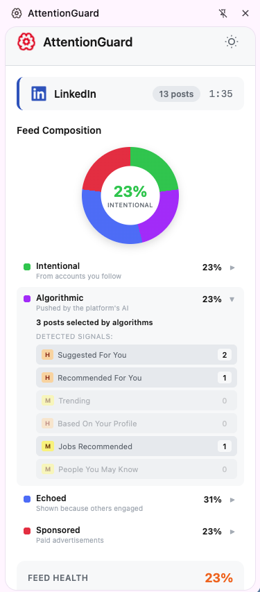
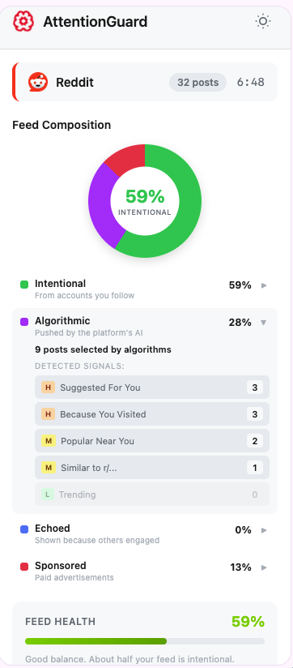
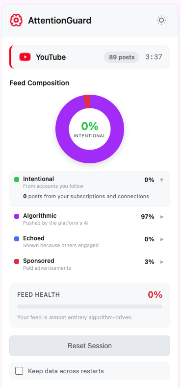

# AttentionGuard

**See how algorithms manipulate your feed in real-time.**

AttentionGuard is an open-source browser extension for **Chrome** and **Firefox** that reveals the hidden manipulation patterns on social media and e-commerce platforms. Watch as your feed fills with ads, algorithmic recommendations, and social signals - all tracked and visualized in real-time.

> Created and Maintained by [AgentKite](https://agentkite.com)

<p align="center">
  
  
  
</p>

<p align="center"><em>Real feed data from LinkedIn, Reddit, and YouTube. How much of your feed did you actually choose?</em></p>

## Supported Platforms

| Platform | Detection Capabilities | Supported routes |
|----------|----------------------|---------------------|
| **Reddit** | Promoted posts, algorithmic suggestions, geo-targeting, behavioral tracking | Homepage |
| **Twitter/X** | Ads, "For You" algorithm, social context (likes, retweets) | Homepage |
| **Facebook** | Sponsored posts, dark patterns (FOMO, social proof, variable rewards), side ads | Homepage |
| **Instagram** | Sponsored content, suggested posts, non-followed accounts | Homepage |
| **LinkedIn** | Promoted content, social reactions, job recommendations, personalization | Homepage |
| **YouTube** | Ads, recommended videos, Shorts, subscription vs algorithm | Homepage |
| **Amazon** | Sponsored products, urgency tactics, price anchoring, coupon prompts | Homepage |

## Installation

### Chrome

1. **Download** - [Download the Chrome build](https://github.com/agentkites/attentionguard-extension/releases/latest/download/attentionguard-1.0.0-chrome.zip) and extract it
2. Open Chrome and go to `chrome://extensions/`
3. Enable **Developer mode** (toggle in top right)
4. Click **Load unpacked**
5. Select the extracted folder
6. Pin the extension to your toolbar for easy access

> **Note:** We're working on getting it listed on the Chrome Web Store for a one-click install.

### Firefox

1. **Download** - [Download the Firefox build](https://github.com/agentkites/attentionguard-extension/releases/latest/download/attentionguard-1.0.0-firefox.zip) and extract it
2. Open Firefox and go to `about:debugging#/runtime/this-firefox`
3. Click **Load Temporary Add-on...**
4. Select `manifest.json` from the extracted folder

> **Note:** Temporary add-ons are removed when Firefox restarts. We're working on getting it listed on the Firefox Add-ons store for a permanent install.

## How It Works

1. **Install the extension** - icon appears greyed out
2. **Visit a supported platform** - icon turns green, tracking begins
3. **Browse normally** - stats update in real-time as you scroll
4. **Click the icon** - see your manipulation breakdown

### What it Tracks

- **Ads** - Sponsored/promoted content you're paying to see
- **Algorithmic** - Content chosen by the platform's algorithm
- **Social** - Content shown because friends engaged with it
- **Organic** - Content from accounts you actually follow

## Privacy

AttentionGuard runs **100% locally** in your browser:
- No data is sent to any server
- No account required
- No tracking of your browsing
- All stats stored locally (session or persistent, your choice)

## Request a New Platform

Don't see your favorite site listed? When you visit an unsupported site, the extension shows a **"Request AttentionGuard for this site"** button. Click it to open a pre-filled GitHub issue — no setup needed. You can also [open one manually](https://github.com/agentkites/attentionguard-extension/issues/new?labels=platform-request).

## Contributing

We welcome contributions! See [CONTRIBUTING.md](CONTRIBUTING.md) for how to:
- Add support for new platforms (check [platform requests](https://github.com/agentkites/attentionguard-extension/issues?q=label%3Aplatform-request) for sites users are asking for)
- Improve detection patterns
- Fix bugs and improve code

### Adding a New Platform

1. Create a new file in `content-scripts/platforms/`
2. Use the core framework (`window.AttentionGuard`)
3. Define your detection patterns
4. Add the platform to `manifest.json` and `manifest.firefox.json`
5. Submit a pull request!

## Architecture

```
attentionguard-extension/
├── manifest.json              # Chrome extension manifest
├── manifest.firefox.json      # Firefox extension manifest
├── build.sh                   # Package for Chrome & Firefox
├── background/
│   └── service-worker.js      # Icon state, message routing
├── content-scripts/
│   ├── core/
│   │   └── attentionguard-core.js  # Shared framework
│   └── platforms/
│       ├── reddit.js
│       ├── twitter.js
│       └── ... (7 platforms)
├── popup/
│   ├── popup.html
│   ├── popup.js
│   └── popup.css
└── assets/icons/
```

## License

This project is licensed under the **MIT License** - see [LICENSE](LICENSE) for details.

## Links

- [GitHub Repository](https://github.com/agentkites/attentionguard-extension)
- [Report Issues](https://github.com/agentkites/attentionguard-extension/issues)
- [AgentKite](https://agentkite.com)

---

**Remember:** The first step to reclaiming your attention is understanding how it's being captured.
